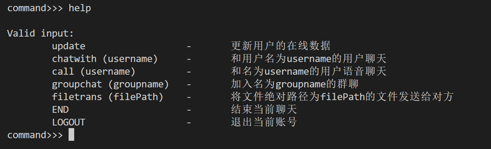
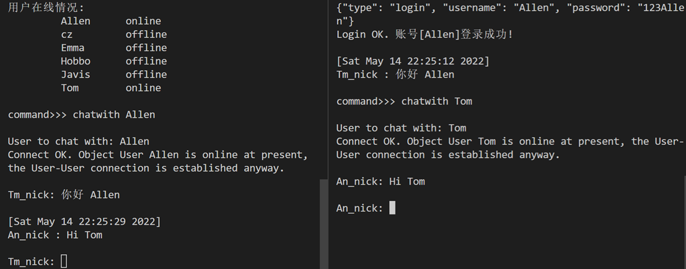
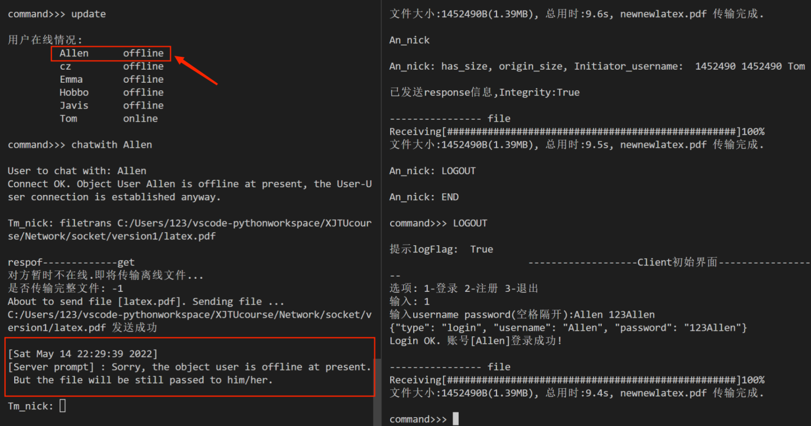

# Socket-based chatting App

> 基于socket的聊天程序
主要为了学习Sockets编程的基本函数和模式、框架；掌握UDP、TCP协议及Client/Server和P2P两种模式的通信原理；掌握Socket编程框架

## 实现的功能
1. **基本功能**
- 支持用户注册，验证用户登录、用户登出(下线)；
- 查看在线的好友信息、选择好友聊天
- 两个用户的文字聊天；
- 用户之间传输文件，包括二进制的大文件（比如 100MB）。
2. **高级功能**
- 支持 NAT 穿透；
- 离线文件和断点续传的支持； 
- 离线消息的支持
- 实时语音聊天；
- 支持群聊。

## 程序文件

**服务器Server程序文件：** 

- `TCP_s1.py`：主程序，依赖于另外3个py类和函数封装文件才能运行，且此服务器程序是基于MySQL数据库的。
- `serverReply.py`：重要的函数方法
- `mysql_util.py`，`user_info_util.py`：数据库相关操作的类和函数

**客户端Client程序文件：**

- `TCP_c1.py`：主程序
- `progressbar.py`：进度条展示函数

## 部分功能使用

登录，聊天：

文件传输+断点续传+离线文件：

**TODO：**

- 代码框架还需优化，过于臃肿，(...naive
- 目前是`cmd`+`Regular Expression`，加上UI体验更好，以及有更多可能性
